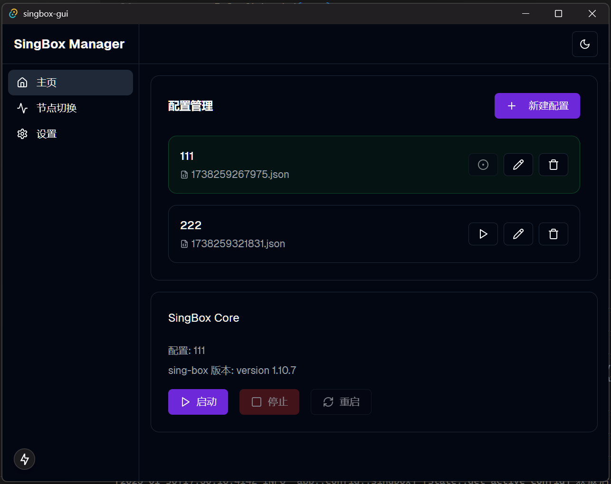
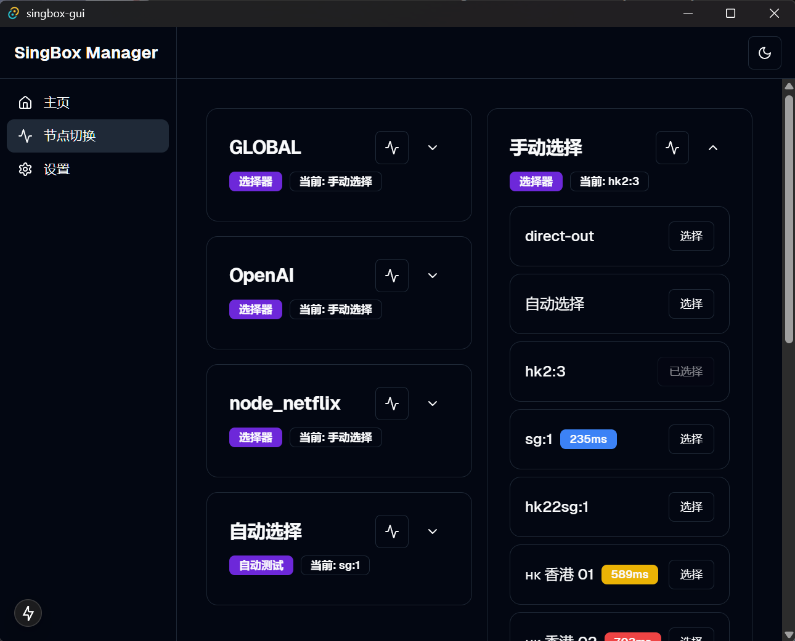

# Singbox GUI

一个基于 Tauri + Next.js 开发的 sing-box 图形界面。

## 功能

支持了配置管理和节点切换

### 配置管理


### 节点切换


## 开发

```bash
# 安装依赖
pnpm install

# 启动开发服务
pnpm tauri dev
```

## bug提交
非常感谢您使用singbox-gui，如果遇到bug，请在github上提交issue，非常感谢。

## 许可证
singbox-gui 使用 [MIT](LICENSE) 许可证。
